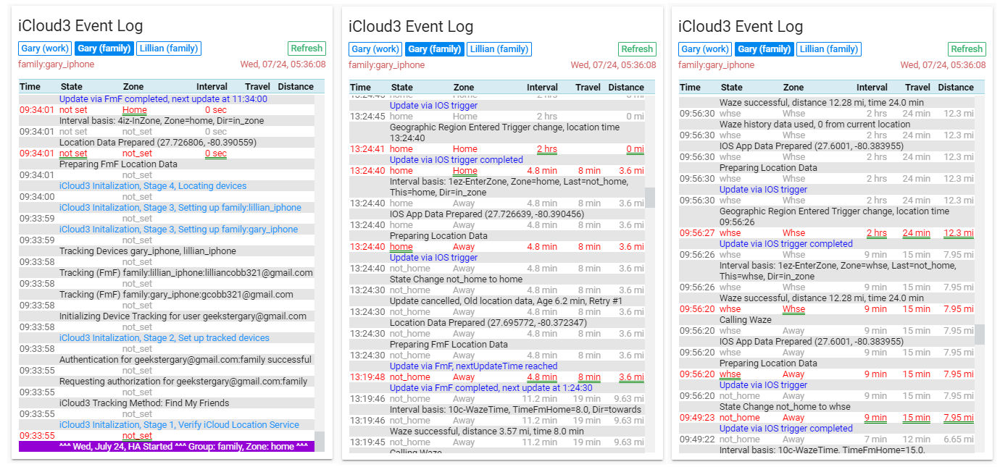

## iCloud3 Change Log -- Consolidation of all changes in v1.1.0

#### Version 1.1.0 - Aug 29 - Beta 8

- **Support for IOS App Version 2** - With this version, you can not specify the device name in the configuration parameters like you can with version 1. Instead, a number is added to the device name. The number the IOS App assigns is specified in the iCloud3 *track_devices* parameter. The number is added to the *tracked devices* attribute for the device.  For example, if the device name in General>Settings>About is `Gary-iPhone`, the icloud (and HA) device name added to *known_devices.yaml* is `gary_iphone`. The iCloud3 tracked_devices configuration parameter will be `gary_iphone` which will create the `device_tracker.gary_iphone entity`. The IOS App may/will add a number to the end of the device name and the entity it will use to provide location data to HA will be `device_tracker.gary_iphone_2` or `device_tracker.gary_iphone_3`, etc. This number (2, 3, etc.) is specified in the iCloud3 track_devices configuration parameter. iCloud3 will then monitor `device_tracker.gary_iphone` for iCloud Location Services updates and `device_tracker.gary_iphone_2` for IOS App updates. The *tracked devices* attribute will be `gary_iphone (_2)` or `gary_iphone (_3)`, etc.
- **Revamped error retries and reporting** - Changed the way account authorization errors, no location data errors, old locations, and gps accuracy errors. Previously, if an error occurred or the data was old or inaccurate, iCloud3 would poll the device every 15-seconds. If there was a location data error, error messages would constantly be generated until the device was reauthorized successfully. iCloud3 will now poll the device on a 15-second interval 4 times. If the error still existed, it will wait 1-minute and try again. If the error still exists, it  retry after 5-minutes, then 15-minutes and finally 30-minutes. It will retry every 30-minutes until the data becomes valid or the device authorization succeeds. A side benefit is you no longer have to pause and then resume polling after putting the device into 'airplane' mode. It will automatically resume after a connection is completed.
- The Waze maximum distance parameter specifies the distance to not use the Waze information for calculating the polling interval. The distance returned from Waze was being used to determine if the Waze data should be used or not used. Now, the calculated distance is now being used to determine if Waze should be called or not.
- Fixed some problems decoding the tracked_devices configuration parameter.
- Fixed a problem with the 'Event Log' custom Lovelace component handling multiple groups.
- Added a Group, Base Zone attribute.
- Cleaned up and consolidated code for consistency.
- Fixed a problem with the *pyicloud_ic3.py* custom component that was generating error log entries.

To be done:

- Further testing with multiple base zones, default groups, multiple of instances of iCloud3, bad email addresses, invalid passwords, etc.

------

#### Version 1.1.0 - July 25 - Beta 7 

**New Tracking Service - Find-my-Friends supports non-2fa iCloud accounts**
iCloud3 can now track devices using the iCloud *Find-my-Friends* Location Services. iCloud3 version 1.0.x located devices using the iCloud Find-my-Phone Location service. If the account used 2-factor authentication, notifications were sent to trusted devices every half-hour or so indicating the iCloud account had been logged into. This made using this service unworkable. With *Find-my-Friends*, iCloud3 can now locate devices tied to a 2fa account (the friends) using another non-2fa account. Instructions for setting up *Find-my-Friends* is found in the iCloud3 documentation.

    In order to support this, devices must be defined by their name instead of scanning the iCloud account looking for devices set up as family members (the *include_device_type* parameter). The following configuration parameters have been replaced by the new *track_devices/track_device* configuration parameter (see below): 
      - include_devices/include_device
      - include_device_types/include_device_type
      - exclude_devices/exclude_device
      - exclude_device_types/exclude_device_type
      - filter_devices
      - sensor_name_prefix
      - sensor_badge_picture

- A customized version of the *pyicloud.py* module is used interact with iCloud Location Services that supports Find-My-Friends. It must be installed in the same directory containing the iCloud3 custom component. You will need to install both the *device_tracker.py* and *pyicloud_ic3.py* files into the *custom_components/icloud3* directory.

- Added the *tracking_method* parameter to indicate how iCloud3 should track devices (iCloud Find-my-Phone (fmphn), iCloud Find-My-Friends (fmf), IOS App (iosapp)). Default is using Find-my-Friends.

- Added the *track_devices/track_device* to specify the devices that should be tracked. The device name identifies the device while the 2fa account email address, the badge sensor picture, IOS App device number and the sensor_name_prefix identify the person with the device being tracked. An example of this parameter is `gary_iphoe > gary.2fa@email.com, gary.png, 2`.

  

**iCloud3 Event Log Custom Lovelace Card**
iCloud3 logs many activities while it starts up, tracks devices, encounters errors, etc. to the HA log file. It also logs them to an internal event log that can be displayed on a custom Lovelace card. 

**Customize Sensors created by iCloud3**
iCloud3 creates many sensors to report tracking, location and other information about the device. You can now control what sensors are created using the new create_sensors and exclude_sensors configuration parameter. A code is assigned to every sensor that is created. The *create_sensors* parameter will only create the ones you specify while the *exclude_sensors* will create all the sensors normally created except for the ones you specify.

**Other Changes**

- Changed the way a date is displayed to see if iCloud3 would run on a Windows based linux platform.
- Expanded and further clarified events in the documentation.
- Code cleanup and optimization.

------

#### Breaking Changes

- Renamed *account_name* to *group* to better clarify that this *account_name* parameter has nothing to do with the iCloud account but really refers to how the devices being tracked are grouped together in a platform. (The *account_name* is automatically converted to *group*).

- Removed all of the configuration parameters named above.

- Renamed *distance* to *zone_distance* to avoid conflicts with the *distance* attributed used by the HA IOS App v2. It refers to the distance of your current location to the *base_zone* (usually "home").

- Renamed *sensor.xxx_distance* to *sensor.xxx_zone_distance* because the *distance* attribute was changed. Any  the name automations, scripts and lovelace.yaml that use the old name will need to be changed.

------

#### New Configuration Parameters

**base_zone**  
Normally, the 'home' zone is the zone used to calculate distances, travel times, update intervals, etc. The *base_zone* lets you do this for a zone other than the 'home' zone. You can, for example, set up a second iCloud3 platform using the same FmF login username/password as you normally do but have the *base_zone* set as a work zone, a second home zone or another zone that you want to use as the basis for device tracking calculations. Another Lovelace card can then be set up to display all of the information for that zone.  

**create_sensors**  
Specify only the sensors that should be created. See Customizing sensors that are created for more information.

**exclude_sensors**  
Create all sensors except the ones specified. See Customizing sensors that are created for more information.

**group**
Described in the *Breaking Changes* section above.

**tracking_method**
Described in the *Breaking Changes* section above.

**tracked_devices/tracked_device**
Described in the *Breaking Changes* section above.

------

#### New Attributes

**zone_distance**
Described in the *Breaking Changes* section above.

