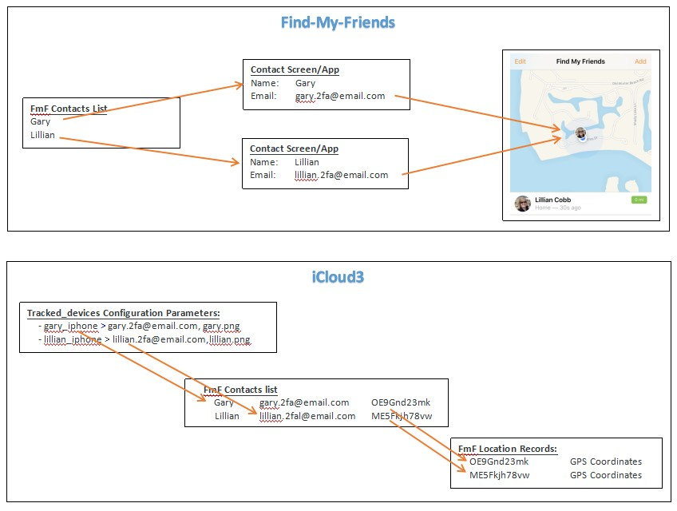

# iCloud3  Device Tracker Custom Component  

- Version:  1.1.0
- Released:  July 25, 2019

------

*[Table of Contents](https://github.com/gcobb321/icloud3#table-of-contents)*

*[Download from the Releases tab here](https://github.com/gcobb321/icloud3/releases)*

----------

## INTRODUCTION

'iCloud3' is an improved version of the iCloud device_tracker component installed with Home Assistant.  It's  purpose is: 

- To connect with the iCloud Location Services using Find-my-Friends and Find-my-Phone. 

- To provide easy-to-use presence detection that does not rely on any other program, other than Home Assistant and the Home Assistant IOS app.
- To be report accurate information (location, distance from home, current zone) on a timely basis that can be used reliably in automations.
- To conserve the devices battery. 
- To correct GPS wandering errors leading to incorrect triggering of automations.
- To provide more distance, travel time, and zone attributes than the base iCloud component that can trigger and control automations and to easily display additional device information on lovelace cards. 

Below are some sample Lovelace screenshots showing how iCloud3 information can be displayed (see *ui-lovelace-icloud3.yaml* in the *configuration files* directory). Example configuration files for sensors, switches, badges, automations and scripts are also found in the *configuration files* directory that report location information and device status, along with running automations (opening a garage door) when arriving home. Other uses (security, lighting, heating & cooling control, etc.) can be added to the automations to meet your needs. 

*Special Note: I want to thank Walt Howd, (iCloud2 fame) who inspired me to tackle this project. I also want to give a shout out to Kovács Bálint, Budapest, Hungary who wrote the Python WazeRouteCalculator and some awesome HA guys (Petro31, scop, tsvi, troykellt, balloob, Myrddyn1, mountainsandcode,  diraimondo, fabaff, squirtbrnr, and mhhbob) who gave me the idea of using Waze in iCloud3...Gary Cobb aka GeeksterGary.* 


### Table of Contents

  * [INTRODUCTION](https://github.com/gcobb321/icloud3#introduction)
    + [Installation](https://github.com/gcobb321/icloud3#installation)
    + [What's different](https://github.com/gcobb321/icloud3#whats-different)
    + [How it works](https://github.com/gcobb321/icloud3#how-it-works)
      - [What other programs do I need](https://github.com/gcobb321/icloud3#what-other-programs-do-i-need)
      - [What happens if I don't have the IOS app on my device](https://github.com/gcobb321/icloud3#what-happens-if-i-dont-have-the-ios-app-on-my-device)
    + [Home Assistant Configuration](https://github.com/gcobb321/icloud3#home-assistant-configuration)
    + [About Your Apple iCloud Account](https://github.com/gcobb321/icloud3#about-your-apple-icloud-account)
    + [HACS - ](https://github.com/gcobb321/icloud3#special-zones)
  * [CONFIGURATION VARIABLES](https://github.com/gcobb321/icloud3#configuration-variables)
    + [User, Account and Device Configuration Items](https://github.com/gcobb321/icloud3#user-account-and-device-configuration-items)
    + [Zone, Interval and Sensor Configuration Items](https://github.com/gcobb321/icloud3#zone-interval-and-sensor-configuration-items)
    + [Waze Configuration Items](https://github.com/gcobb321/icloud3#waze-configuration-items)
  * [ATTRIBUTES](https://github.com/gcobb321/icloud3#attributes)
    + [Location and Polling Attributes](https://github.com/gcobb321/icloud3#location-and-polling-attributes)
    + [Device Status Information Attributes](https://github.com/gcobb321/icloud3#device-status-information-attributes)
    + [Other Attributes](https://github.com/gcobb321/icloud3#other-attributes)
  * [iCLOUD3 EVENT LOG](https://github.com/gcobb321/icloud3#icloud3-event-log)
  * [SPECIAL ZONES](https://github.com/gcobb321/icloud3#special-zones)
    + [Dynamic Stationary Zone](https://github.com/gcobb321/icloud3#dynamic-stationary-zone)
    + [near_zone Zone](https://github.com/gcobb321/icloud3#near_zone-zone)
  * [SENSORS CREATED FROM DEVICE ATTRIBUTES](https://github.com/gcobb321/icloud3#sensors-created-from-device-attributes)
    + [How they are used in Automations and on Lovelace Cards](https://github.com/gcobb321/icloud3#how-they-are-used-in-automations-and-on-lovelace-cards)
    + [Special Sensors](https://github.com/gcobb321/icloud3#special-sensors)
    + [Use *sensor.devicename_zone* instead of *device_tracker.devicename state* for zone change](https://github.com/gcobb321/icloud3#use-sensordevicename_zone-instead-of-device_trackerdevicename-state-for-zone-change)
    + [Naming the Sensor](https://github.com/gcobb321/icloud3#naming-the-sensor)
  * [DEVICE TRACKER SERVICES](https://github.com/gcobb321/icloud3#device-tracker-services)
    + [*icloud_update* Service  --  Control How iCloud3 Operates](https://github.com/gcobb321/icloud3#icloud_update-service------control-how-icloud3-operates)
    + [*icloud_set_interval*  Service  --  Override the interval](https://github.com/gcobb321/icloud3#icloud_set_interval--service------override-the-interval)
    + [*icloud_lost_iphone*  Service --  Play a tune to find your phone](https://github.com/gcobb321/icloud3#icloud_lost_iphone--service-----play-a-tune-to-find-your-phone)
    + [*icloud_restart* Service -- Restart the iCloud3 Component](https://github.com/gcobb321/icloud3#icloud_restart-service----restart-the-icloud3-component)
  * [TECHNICAL INFORMATION](https://github.com/gcobb321/icloud3#technical-information)
    + [How the Interval is Determined](https://github.com/gcobb321/icloud3#how-the-interval-is-determined)
    + [Displaying Interval Calculation Information in the *Info* Field](https://github.com/gcobb321/icloud3#displaying-interval-calculation-information-in-the-info-field)
    + [Writing Debug Information to the HA Log File](https://github.com/gcobb321/icloud3#writing-debug-information-to-the-ha-log-file)


### Installation

iCloud3 uses the GitHub Releases framework to download all the necessary installation files (iCloud3 custom component, documentation, sample configuration files, sample lovelace cards, etc). Go to the 'Releases' tab at the top of this repository, select the version of iCloud3 you want and download the .zip file. 

- HA 0.92+ -- Create a *config/custom_components/icloud3* directory on the device (Raspberry Pi) running Home Assistant. Copy the five component files in the `custom_components-icloud3` Github directory (*device_tracker.py, pyicloud_ic3.py, init.py, manifest.json, services.yaml*)  into that directory so the directory structure looks like:

  ```
  config
    custom_components
      icloud3
        device_tracker.py
        pyicloud_ic3.py
        __init__.py
        manifest.json
        services.yaml
  ```

*Note:* The WazeRouteCalculator component is use to calculate driving distance and time from your location to your Home zone (or another *base_zone* zone). Normally, it is installed with the Home Assistant and Hass.io frameworks. However, if it is not installed on your system, you can go [here](https://github.com/kovacsbalu/WazeRouteCalculator) for instructions to download and install Waze. If you don't want to use Waze or are in an area where Waze is not available, you can use the 'direct distance' method of calculating your distance and time from the Home zone  (or another *base_zone* zone). Add the `distance_method: calc` parameter to your device_tracker: icloud3 configuration setup (see more information on this and other parameters later).

iCloud3 logs information to the HA log file and to an internal table that can be viewed using the iCloud3 Event Log Lovelace Custom Card. Information about this custom card, and installation instructions are described here.

*[Top](https://github.com/gcobb321/icloud3#table-of-contents)*

### What's different

iCloud3 has many features not in the base iCloud device_tracker that is part of Home Assistant. It exposes many new attributes, provides many new features, is based on enhanced route tracking methods, is much more accurate, and includes additional service calls. Lets look at the differences.

| Feature | Original iCloud | iCloud3 |
|---------|-----------------|---------|
| Integration with the HA IOS App            | No                                                           | Yes, Geographic Zone Enter/Exit, Background Fetch, Significant Location Update & Manual transactions are detected and processed immediately after they are issued. |
| Device Selection                           | None                                                         | Specify devices to be tracked by their devicename, i.e., `gary_iphone, lillian_iphone` using the *tracked_devices* parameter. |
| Locate device using Find-my-Phone | Yes | Yes, using the *tracking_method: fmphn* parameter |
| Locate device using Find-my-Friends | No | Yes, using the default *tracking_method: fmf* parameter |
| Locate device using HA IOS App without iCloud Services | No | Yes, using the *tracking_method: iosapp* parameter |
| Minimum Poll Interval | 1 minute | 15 second |
| Distance Accuracy | 1 km/mile | .01 km/mile |
| Variable Polling | Yes - Based on distance from home or (or another *base_zone* zone), battery level, GPS Accuracy | Yes, based on distance from home (or another *base_zone* zone), Waze travel time to home (or another *base_zone* zone), direction of travel, if the device is in a zone, battery level, GPS Accuracy, 'old location' status. |
| Detects zone changes | No - Also requires other device_trackers (OwnTracks, Nmap, ping, etc. | Yes, no other programs are needed other than the HA IOS App. |
| Detects when leaving Home Zone (or another *base_zone* zone) | Delayed to next polling cycle (default of 30-minutes) | Detects when the Home Assistant IOS app issues a Zone Enter/Exit notification |
| Discards old transactions | No | Yes, if older than 2-minutes or with poor gps accuracy. |
| Fixes 'Not Home' issue when in Sleep Mode | No | Yes, by discarding all transactions that are closer than 1-km when the device is in a zone and by providing zone template sensors that are used to trigger automations rather than device_tracker state changes. |
| Integrates with Waze route/map tracker | No | Yes, the Waze travel time is used to determine the 'polling interval'. Waze can be disabled if not available using configuration parametres. |
| Device Polling Interval when close to home (or another *base_zone* zone) | 1+ minutes (?) | 15-seconds |
| Dynamic Stationary Zone | No | Yes, a Stationary Zone is created if no movement has been detected in 8-minutes (configurable). The polling interval is set to 30-minutes (default) until zone exit notification is received. |
| Service call commands | Set polling interval, Reset devices | Set polling interval, Reset devices, Pause/restart polling, Change zone, Enable/disable Waze Route information usage, information logging (some commands can be for all devices or for a specific device) |
| Track device from more than one location | No, can only track from the 'home' zone | Yes, can track from the 'home' zone and another *base_zone* zone (office, second home, etc.). |
| Display an Event Log of significant events | No | Yes |
| Create Sensors for device attributes | No | Yes. Sensors created can be customized to only create the ones you want or exclude sensors from thone4 normally created by iCloud3. |
| | | |
| <u>Geekster Statistics:</u> | | |
| ● Config variables | 5 | 22 |
| ● Attributes | 20 | 35+ |
| ● Service Calls | 4 | 4 + 15 special commands |
| ● Lines of code | 425 | 6000+ |

*[Top](https://github.com/gcobb321/icloud3#table-of-contents)*

### How it works

iCloud3 operates on a 5-second cycle, looking for transactions from the HA IOS App. It looks for Geographic Zone Enter/Exit, Background Fetch, Significant Location Update and Manual transactions. When one is detected, it determines if the transaction is current before it is processed. Transactions older than 2-minutes are discarded. Additionally, to minimize GPS wandering and out-of-zone state changes, transactions within 1km of a zone are discarded when the device is in a zone.  Every 15-seconds, it determines if any devices needed to be polled using the iCloud Location Services Find-my-Friends or Find-my-Phone methods as described below.

iCloud3 polls the device on a dynamic schedule and determines the polling interval time based on:

 - If the device is in a zone or not in a zone. The zones include the ones you have set up in zone.yaml and a special Dynamic Stationary Zone that is created by iCloud3 when you haven't changed your location in a while (shopping center, friends house, doctors office, etc.)
 - A 'line-of-sight' calculated distance from 'home' (or another *base_zone* zone) to your current location using the GPS coordinates.
 - The driving time and distance between 'home' (or another *base_zone* zone) and your current location using the [Waze](http://www.waze.com) map/driving/direction service. 
 - The direction you are going — towards home (or another *base_zone* zone), away from home or stationary.
 - The battery level of the device.
 - The accuracy of the GPS location and if the last poll returned a location that the iCloud service determined was 'old'.

The above analysis results in a polling interval. The further away from home (or another *base_zone* zone) and the longer the travel time back to home, the longer the interval; the closer to home, the shorter the interval. The polling interval checks each device being tracked every 15-seconds to see if it's location should be updated. If so, it and all of the other devices being tracked with iCloud3 are updated (more about this below). With a 15-second interval, you track the distance down 1/10 of a mile/kilometer. This gives a much more accurate distance number that can used to trigger automations. You no longer limited to entering or exiting a zone. 

Note: Another custom component module (`pyicloud_ic3.py`) is responsible for communicating with the iCloud Location Services to authenticate the iCloud account and to locate the devices associated with the account using either Find-my-Friends or Find-my-Phone methods (more about the differences below). If the iCloud account is associated with several devices, all of the devices are polled, whether or not the device is being tracked by Home Assistant. This is a limitation of pyicloud.py. 


*[Top](https://github.com/gcobb321/icloud3#table-of-contents)*

#### What other programs do I need

The `Home Assistant IOS App` is all. You do not need `OwnTracks` or other location based trackers and you do not need `nmap`, `netgear`, `ping` or any network monitor. The `Home Assistant IOS App` will notify Home Assistant when you leave home (or another *base_zone* zone) and iCloud3 device tracker will start keeping up with the device's location, the distance to home and the time it will take to get there.  

*Note:* The IOS App settings `Zone enter/exit`, `Background Fetch` and `Significant Location Change` location settings need to be enabled. 

The `iCloud` platform allows you to detect presence using the  [iCloud](https://www.icloud.com/) service. iCloud allows users to track their location on iOS devices. Your device needs to be registered with Find-my-Friends/Find-my-Phone.

The HA proximity component also determines distance between zones and the device, determines direction of travel, and other device_tracker related functions. Unfortunately, the IOS App reports old location information on a regular basis that is processed by the proximity component. 

​		[It is highly recommended to not use the proximity component when using iCloud3.]()

​		[iCloud3 duplicates the proximity functions and discards bad location information]()

​		[where the proximity component does not.]()

*[Top](https://github.com/gcobb321/icloud3#table-of-contents)*

#### What happens if I don't have the IOS app on my device

The  `Home Assistant IOS App`  issues zone enter/exits and pushes location updates to HA; the iCloud Find-my-Friends/Find-my-Phone issues location updates and other device information when asked by iCloud3. They both must map to the same device (see about assigning device_names a little later). If they do not, or if the IOS app is not installed on the device, the zone enter/exits will not be picked up when they actually happen.

They will be updated, however, on the next poll by iCloud3. The problem with not having the IOS app installed is if you are in a zone and on a 2-hour polling interval, it could be 2-hours before the device goes to a not_home state. With the IOS app, the zone exit is pushed it to HA where it gets picked up by iCloud3 and the device's state is changed. This happens within 10-seconds of getting the exit notification the zone. Naturally, if you are in a poor service area, this notification may be delayed.

```
# Example device names:
iPhone Settings -- General>About = Gary-iPhone
IOS App name    -- gary_iphone 
    
Note: Special characters (’-’) get mapped to ‘_’ by HA.
```

*[Top](https://github.com/gcobb321/icloud3#table-of-contents)*

#### What happens if the iCloud Location Service is not available or I don't want to use it

When iCloud3 starts, if *tracking_method* is 'fmf' of 'fmphn', the iCloud account is accessed for device and location information. If the iCloud account can not be accessed (the Apple iCloud service is down, an error authorization error is returned from the iCloud service, the account can not be found, the account name and password are not correct, etc.), iCloud3 will issue an error message and revert to using the IOS App (*tracking_method: iopsapp*). The following occurs:

- iCloud3 will rely on HA IOS app to provide Zone Exit, Zone Enter, Background Fetch, Significant Location Update and Manual triggers to know where the device is located.

- iCloud3 will not poll the device on a regular basis since it can't access the iCloud Find-My-Friends/Find-my-Phone Location Service. The decreasing interval as you approach home (or another *base_zone* zone) will be not be done. Automations and scripts based on a short distance from home will not trigger. Automations and scripts triggered on a zone change should continue to work.

- The device is not located when HA starts. It may take a few minutes to process the next IOS app notification to locate the device.

  

  Note: iCloud3 can be restarted using the service call  *icloud_update* with the *restart* command or the service call *icloud_reset*. If you use Find-my-Friends/Find-my-Phone, the iCloud Location Service will be rechecked and used if it is available. 

*[Top](https://github.com/gcobb321/icloud3#table-of-contents)*

### Home Assistant Configuration

To integrate iCloud3 in Home Assistant, add the following section to your `configuration.yaml` file:

```yaml
device_tracker:
  - platform: icloud3
    username: gary-fmf-acct@email.com       <<< Your Apple iCloud Account ID for your FmF iCloud account
    password: gary-fmf-password
    group: family                      <<< Name of this group of tracked devices.
    tracked_devices:                   <<< Devices to be tracked
      - gary_iphone > gary-2fa-acct@email.com, gary.png
      - lillian_iphone > lillian-2fa-acct@email.com, lillian.png
```

If you have several devices that are associated with different Apple iCloud accounts or if you want to use a location other than 'home' as your *base_zone*, add a second iCloud3 platform with the other iCloud account or zone information.

This is an example of using two icloud3 platforms.

```yaml
device_tracker:
  - platform: icloud3
    username: gary-fmf-acct@email.com       <<< Your Apple iCloud Account ID for your FmF iCloud account
    password: gary-fmf-password
    group: family                      <<< Name of this group of tracked devices.
    tracked_devices:                   <<< Devices to be tracked
      - gary_iphone > gary-2fa-acct@email.com, gary.png
      - lillian_iphone > lillian-2fa-acct@email.com, lillian.png

device_tracker:
  - platform: icloud3
    username: gary-fmf-acct@email.com       <<< Your Apple iCloud Account ID 
    password: gary-fmf-password
    group: work                        <<< Name of this group of tracked devices.
    base_zone: whse                    <<< Track from the 'whse' zone instead of 'home'
    tracked_devices:                   <<< Devices to be tracked
      - gary_iphone > gary-2fa-acct@email.com, gary.png
```

*Note:* When a devices location is polled, the Waze Route Calculator is called to get distance from home or another *base_zone* zone, and the travel time information. The data returned from the Waze Route Calculator is saved. On the next poll of any device using iCloud3 on the same account, the saved data is searched to see if there is any entry that is close to your current location instead of calling the Waze Route Calculator again

Only devices on the same *group* can share Waze data. In HA, each device_tracker platform operates independently of each other even though they are both using the iCloud3 account. For example, devices set up in one platform (e.g., `group: family`) and devices set up on another platform (e.g., `group: work`) don't know about each other so they can not share Waze data

*Note:* The same devicename can be in more than one group. Each group would have a different group name and different base zone when tracking with Find-my-Friends. IOS App triggers will be picked up by both instances of the same device even though they are in different groups. HA still treats it as one device, i.e., zone enter/exit notifications get picked up be the device in each group. iCloud3 will then base it's calculations on the *base_zone* of the group.   

iCloud3 creates sensors for all of the attributes associated with a device that can be used on Lovelace cards and in automations and scripts. See the section on Sensors for more information about this.

*[Top](https://github.com/gcobb321/icloud3#table-of-contents)*

### About Your Apple iCloud Account

When you set up an Apple iCloud account, '2 Step Authentication (2fa)' is normally turned on account. This has an enormous impact on how your iCloud account is accessed. 

- **2fa is turned on**   In order retrieve location information, iCloud3 must establish a computer-to-computer link with the Apple iCloud account and it has to be authenticated every time the account is accessed. Unfortunately, the HA computer can not be set up as a 'Trusted Device', so every 30-minutes, or so, Apple Apple logs the HA computer, and thus iCloud3, out of the account. The result is HA and iCloud3 must log back into the account when it wants new location information. 

  Every time you log into your Apple iCloud account, Apple sends a notification to your trusted devices informing you that your account has been logged into for your approval (a map is displayed with an Allow/Don't Allow message), followed by a second notification containing a 6-digit code that you can not do anything with.  

  This gets annoying and makes working with iCloud accounts with 2fa unworkable.

- **2fa is not turned on**   None of the above happens.


Two methods are available for locating your device using iCloud Location Services:

- **Find-my-Friends (FmF)**   You set up friends on the Find-my-Friends app and iCloud3 will locate them just like the app does. Since your Apple iCloud account probably has 2fa turned on, you need to:

  1. Add a new FmF iCloud account (with different email address) with 2fa turned off. You will use this email address in the *username* configuration parameter.

  2. Add the friends you want to track in the Contacts App. You only need to enter their name and email address.

  3. Add them to the Find-my-Friends App.

  4. Verify that the Find-my-Friends App can locate them.

  *Note:* This is easier to set up if you do it on a device you will not be locating. 

  *Note:* IOS 13 turns on 2fa automatically and it can not be turned off. The non-2fa account will need to be added on a computer instead of an iphone or ipad.

- **Find-my-Phone (FmPhn)**   If you do not have 2fa turned on on your 'real' iCloud account, you can use FmPhn to locate your device(s). iCloud3 looks for the devices to be tracked in the Family Sharing list. With FmPhn, you can use your 'real' iCloud account email address for the *username*  configuration parameter.

The *tracking_method* and *tracked_devices* configuration parameters are used to indicate how tracking should be done and the devices to be tracked.




**Authenticating Your iCloud Account**

iCloud needs to approve Home Assistant, and iCloud3, access to your account. It does this by sending an authentication code via a text message to a trusted device, which is then entered in Home Assistant. The duration of this authentication is determined by Apple, but is now at 2 months.  

When your account needs to be authorized, or reauthorized, you will be notified and the Notification Bell on the Home Assistant screen. This can be found in the upper right-corner for HA 95 and earlier and in the lower-left for HA 96 and later.  Take the following steps to complete the process:  
    1. Press the Notification Bell of your Home Assistant screen to open the Notification window.
        2. A window is displayed, listing the trusted devices associated with your account. It will list an number (0, 1, 2, etc.) next to the phone number that can receive the text message containing the 2 Step Authentication code number used to authenticate the computer running Home Assistant (your Raspberry Pi for example).
        3. Type the number.

  4. A text message is sent. Type the authentication code you receive in the next window that is displayed.


**Associating the iPhone Device Name with Home Assistant using the Home Assistant IOS App** 
The Device Name field of the device in *Settings App>General>About>Name* field on the iPhone and iPad and in the Apple Watch App for the iWatch is stored in the iCloud account and used by Home Assistant to identify the device. HA converts any special characters found in the Device Name field to an underscore ('_'), e.g., 'Gary-iPhone' becomes 'gary_iphone' in *known_devices.yaml*, automations, sensors, scripts, etc. The value, 'gary_iphone', in the Device ID field in the *Home Assistant IOS App>Settings* ties everything together. 

*[Top](https://github.com/gcobb321/icloud3#table-of-contents)*


### HACS (Home Assistant Community Store)

HACS is a custom component that monitors update to other custom components, lovelace custom cards, etc. iCloud3 will be listed on the store shortly. However, additional repositories can be added under the settings window and those repositories will also be monitored. The iCloud3 repository is structured to support HACS usage. To add iCloud3, 

1. Go to Settings.
2. Add *gcobb321/icloud3* to the Add Custom Repository field.
3. Select *Integration* in the Type list.
4. Click the Save icon.   

Installation instructions and all of the documentation for HACS is found [here](https://github.com/custom-components/hacs).


## CONFIGURATION VARIABLES

### User, Account and Device Configuration Items

**username**  
*(Required)* The username (email address) for the iCloud account. 

**password**  
*(Required)* The password for the account.

**group**  
The name of the group of devices being tracked for username/base_zone.  
*Note:* If this isn’t specified, the name part of the username (the part before the `@` in the email address) and the base_zone name will be used.

**tracking_method**  
Select the method to be used to track your phone or other device. iCloud3 supports three methods of tracking a device -- iCloud Find-My-Phone Location Services, iCloud Find-My-Friends Location Services and the HA IOS App version 1 and version 2 (version 2 not available yet). 

*Valid values: fmf, fmphn, iosapp, iosapp1, iosapp2.     Default value: fmf*

**track_devices**  (or  **track_device**)
*(Required)*  Identifies the devices to be tracked, their associated email addresses, badge pictures, an IOS App identification number and a name that should be uses for the device's sensors.  

 *Format:* 

 `devicename > email_address, badge_picture_name, IOS App Id Number, sensor_prefix_name`

| Field              | Description/Notes                                            |
| ------------------ | ------------------------------------------------------------ |
| email_address      | *Required for the tracking_method: fmf*. FmF uses the "real" email address of your "friends" iCloud account to link it with the FmF account. <br><br>You can use the complete email address `(gary-2fa-acct@email.com)` or just the name part `(gary.fmf`).<br><br>Not required if you are using the Find-my-Phone (fmphn) or iosapp (iosapp#) tracking methods. (You can omit the comma placeholder) |
| badge_picture_name | The file name containing a picture of the person normally associated with the device. See the sensor_badge section of the iCloud3 documentation for more information about the sensor_badge.<br>The file is normally in the ```config/www/``` directory (referred to as '/local/' in HA). You can use the full name ```(/local/gary.png)``` or an abbreviated name ```(gary.png)```. |
| IOS App Id Number  | At the present time, the IOS App version 2 does not provide any means of identifying the physical device with the device being tracked. A number '_2', ' _3', etc is added to the attribute to make the attribute name unique.<br><br>This field is reserved for the device's Id number assigned by the IOS App. This field is not needed if you are using version 1. |
| sensor_name_prefix | See the Sensor section of the documentation for a complete description of this field. (garyc in the example below) |

  

```yaml
  Examples:
  
    - gary_iphone > gary-2fa-acct@email.com, /local/gary.png
    - gary_iphone > gary-2fa-acct, gary.png, 1        <<< IOS App Id v2 ' _1'
    - gary_iphone > gary-2fa-acct, gary.png,, garyc   <<< '/local/' will be added
    - gary_iphone > ,gary.png, 1, garyc           <<< using method fmphn or iosapp, email not needed
	- gary_iphone > /local/gary.png
	- gary_iphone > gary.png                      <<< FmPhn, iosapp tracking method with badge picture
	- gary_iphone                                 <<< FmPhn tracking method without a badge picture
	 
	Notes:
	  - A greater then sign ('>') separates the devicename from the parameters.
    
    
  Example of minimum device_tracker.yaml (using tracking_method: fmf):
  
  - platform: icloud3
    username: gary-fmf-acct@email.com
    password: gary-fmf-password
    group: family
    track_devices:
      - gary_iphone > gary-2fa-acct@email.com, gary.png
      - lillian_iphone > lillian-2fa-acct@email.com, lillian.png
```

  


*[Top](https://github.com/gcobb321/icloud3#table-of-contents)*

### Zone, Interval and Sensor Configuration Items

**base_zone**  
Normally, the 'home' zone is the zone used to calculate distances, travel times, update intervals, etc. The *base_zone* lets you do this for a zone other than the 'home' zone. You can, for example, set up a second iCloud3 platform using the same FmF login username/password as you normally do but have the *base_zone* set as a work zone, a second home zone or another zone that you want to use as the basis for device tracking calculations. Another Lovelace card can then be set up to display all of the information for that zone.  

*Note:* If you use the same devicename in more than one zone, the device_tracker attributes for the device are for the latest zone polled.

*Note:* Throughout this document, you will see references to the 'home' zone. If you are tracking the device using more than one zone, the term 'home' will refer to that zone.

*Valid values: existing zone names.  Default value: home*

*Format:*  `base_zone: base_zone_name, sensor_prefix` (`base_zone: office`)`

| Field          | Description/Notes                                            |
| -------------- | ------------------------------------------------------------ |
| base_zone_name | Name of the zone, other than the 'home' zone, on which to base all distance and time calculations. |
| sensor_prefix  | - Not specified - Use the base_zone_name as the sensor_prefix<br> (`base_zone: offc --> sensor.offc_gary_travel_time`)<br><br> - "noprefix" - Do not use the base_zone_name in the sensor_prefix<br>(`base_zone: offc, noprefix --> sensor.gary_iphone_travel_time`) <br><br>"custom_text" - Use the text value as the sensor_prefix<br>(`base_zone: offc, piper --> sensor.piper_gary_iphone_travel_time`) |

*Note:* Sensors are normally named using the devicename (or a value you specify on the *track_devices* parameter), followed by the attribute name (`sensor.gary_iphone_travel_time`). When the *base_zone* parameter is used, it is added to the sensor name before the devicename (`sensor.office_gary_iphone_travel_time`) 

**inzone_interval**  
The interval between location updates when the device is in a zone. This can be in seconds, minutes or hours, e.g., 30 secs, 1 hr, 45 min, or 30 (minutes are assumed if no time qualifier is specified).  
*Default: 2 hrs*

**stationary_inzone_interval**  
The interval between location updates when the device is in a Dynamic Stationary Zone. This can be minutes or hours, e.g., 1 hr, 45 min, or 30 (minutes are assumed if no time qualifier is specified).  
*Default: 30 min*

**stationary_still_time**  
The number minutes of with little movement minutes before the device will be put into its Dynamic Stationary Zone.   
*Valid values: Number. Default: 8*  

**unit_of_measurement**  
The unit of measure for distances in miles or kilometers.   
*Valid values: mi, km. Default: mi*

**gps_accuracy_threshold**  
iCloud location updates come with some gps_accuracy varying from 10 to 5000 meters. This setting defines the accuracy threshold in meters for a location updates. This allows more precise location monitoring and fewer false positive zone changes. If the gps_accuracy is above this threshold, a location update will be retried again in 2 minutes to see if the accuracy has improved. After 5 retries, the normal interval that is based on the distance from home, the waze travel time and the direction will be used.  
*Default: 100*

*Note:* The accuracy and retry count are displayed in the `info` attribute field (*GPS.Accuracy-263(2)*) and on the `poll_count`  attribute field (*2-GPS*). In this example, the accuracy has been poor for 2 polling cycles.  

**create_sensors**  
Specify only the sensors that should be created. See Customizing sensors that are created for more information.

**exclude_sensors**  
Create all sensors except the ones specified. See Customizing sensors that are created for more information.


*[Top](https://github.com/gcobb321/icloud3#table-of-contents)*

### Waze Configuration Items

**distance_method**  
iCloud3 uses two methods of determining the distance between home and your current location — by calculating the straight line distance using geometry formulas (like the Proximity sensor) and by using the Waze Route Tracker to determine the distance based on the driving route.  If you do not have Waze in your area or are having trouble with Waze. change this parameter to *calc* to set the interval using the distance between your current location and home rather than the Waze travel time. 
*Valid values: waze, calc. Default: waze*  

**waze_min_distance, waze_max_distance**  
These values are also used to determine if the polling internal should be based on the Waze distance. If the calculated straght-line distance is between these values, the Waze distance will be requested from the Waze mapping service. Otherwise, the calculated distane is used to determine the polling interval. 
*Default: min=1, max=1000*  

*Note:* The Waze distance becomes less accurate when you are close to home. The calculation method is better when the distances less than 1 mile or 1 kilometer.  
*Note:* If you are a long way from home, it probably doesn't make sense to use the Waze distance. You probably don't have any automations that would be triggered from that far away. 

**waze_realtime**  
Waze reports the travel time estimate two ways — by taking the current, real time traffic conditions into consideration (True) or as an average travel time for the time of day (False).  
*Valid values: True, False. Default: False*  

**waze_region**  
The area used by Waze to determine the distance and travel time.  
*Valid values: US (United States), NA (North America), EU (Europe), IL (Isreal). Default: US*  

**travel_time_factor**  
When using Waze and the distance from your current location to home is more than 3 kilometers/miles, the polling interval is calculated by multiplying the driving time to home by the `travel_time_factor`.  
*Default: .60*  

*Note:* Using the default value, the next update will be 3/4 of the time it takes to drive home from your current location. The one after that will be 3/4 of the time from that point. The result is a smaller interval as you get closer to home and a larger one as you get further away.  

*[Top](https://github.com/gcobb321/icloud3#table-of-contents)*


## ATTRIBUTES

There are numerous attributes that are available for use in automations or to monitor the location of your device. They are shown in following table.  


### Location and Polling Attributes

**interval**  
The current interval between update requests to your iCloud account for the location and other information. They increase as you get further away and decrease as you get closer to home.  

**travel_time**  
The Waze travel time to return home from your current location.  

**zone_distance**  
The distance from the zone (i.e., home, office) that is being used by the interval calculator. This will be either the Waze distance or the calculated distance.  

**waze_distance**  
The driving distance from home returned by Waze based on the shortest route.  

**calc_distance**  
The 'straight line' distance that is calculated using the latitude and longitude of home and your current location using geometric formulas.  

**zone, last_zone**  
The device's current and last zone. This is not to be confused with the device's state. The state can be changed by other programs (IOS app or automations issuing device_tracker.see service calls) where the zone attribute is only updated by iCloud3. Using the Zone attribute to trigger an automation eliminates the gps wandering problems (or greatly reduces them). 

**zone_timestamp**  
When the device's zone was last changed.

**dir_of_travel**  
The direction you are traveling — towards home, away from home, near home, or stationary. This is determined by calculating the difference between the distance from home on this location update and the last one. Stationary can be a little difficult to determine at times and sometimes needs several updates to get right.  

**last_update**  
The time of the last iCloud location update.  

**next_update**  
The time of the next iCloud location update.  

**last_located**  
The last time your iCloud account successfully located the device. Normally, this will be a few seconds after the update time, however, if you are in a dead zone or the GPS accuracy exceeds the threshold, the time will be older. In this case, a description of the issues is displayed in the `info` attribute field.  

**poll_count**  
The number of iCloud, IOS App and discarded transaction counts for the day. It's format is '##:##:##', e.g., '10:14:21' with the iCloud count (10) first, the IOS App (14) second and discarded transactions (21) third.

**info**  
A message area displaying information about the device. This includes the battery level, Waze status, GPS accuracy issues, how long the device has been stationary, etc.  

**trigger**  
The action or notification that caused the last update (Geographic Zone Entered or Exited, Background Fetch, Manual, iCloud, etc.).

**timestamp**  
When the last update was completed.


*[Top](https://github.com/gcobb321/icloud3#table-of-contents)*

### Device Status Information Attributes

**battery**  
The battery level of the device. This is not available for the Find-my-Friends tracking method.  

**battery_status**  
Charging or NotCharging. This is not available for the Find-my-Friends tracking method. 

**latitude, longitude, altitude**  
The location of the device.  

**source_type**  
How the the `Home Assistant IOS App` located the device. This includes gps, beacon, router.  

**device_status**  
The status of the device — online if the device is located or offline if polling has been paused or it can not be located.  

**low_power_mode**  
If the device is running in low power mode.

**speed, altitude, course, floor, vertical_accuracy**  
Device information provided by the iCloud account.  This information is not verified by iCloud3 and passed along as reported by the IOS app.


*[Top](https://github.com/gcobb321/icloud3#table-of-contents)*

### Other Attributes

**authenticated**  
When the device's iCloud account was last authenticated.  

**tracked devices**  
The devices that are being tracked based on the 'includes' and 'excludes' specified in the configuration.yaml file.  This will be the same for all devices tracked.  

**account name**  
Name of the iCloud account associated with the tracked devices.  

**icloud3_version**  
The version of iCloud3 you are running.  

**trigger**  
The trigger causing the last device update. It is also used to communicate between different zone instances when more than one zone is being used.

*[Top](https://github.com/gcobb321/icloud3#table-of-contents)*


## iCLOUD3 EVENT LOG

As iCloud3 runs, various entries are written to the HA log file that show device information, how it is tracked, operational errors, startup information and other items that may help determine what is going on if there is a problem. A lot of this information is also written to the iCloud3 Event Log which can be viewed using the iCloud3 Event Log Lovelace Card. 

Below are 3 screens. The one on the left shows iCloud3 starting up, the middle one shows arriving Home and the one on the right shows entering the 'Whse' zone.


**Installation**

Custom Lovelace cards are typically stored in the */www/custom_cards* directory. Do the following:

1. Create the */www/custom_cards* directory if it does not exist. 

2. Copy the *icloud3-event-log-card.js* into the */www/custom-cards* directory. If you are already using custom cards and they are in a different directory,  copy the *.js* file into the one you are using.

3. Open the *ui-lovelace.yaml* file and add the following lines to the beginning of the file. Again, change the directory name if you are using a different location.

   ```yaml
   resources:
     - url: /local/custom_cards/icloud3-event-log-card.js?v=1.000
       type: js
   ```

4. Add the following lines to the *ui-lovelace.yaml* file to create the custom card. 

   ```yaml
    - title: iCloud Event Log
       icon: mdi:information-outline 
       cards: 
         - type: custom:icloud3-event-log-card
           entity: sensor.icloud3_event_log
   ```

More information is found in the Home Assistant Lovelace documentation regarding setting up and using custom cards. Be sure to refer to if if you have any problems. Go [here](https://community.home-assistant.io/t/how-do-i-add-custom-cards-with-the-lovelace-ui/97902) for more information If you are not using the *ui-lovelace.yaml* file to set up your cards.

*[Top](https://github.com/gcobb321/icloud3#table-of-contents)*


## SPECIAL ZONES  

There are two zones that are special to the iCloud3 device tracker - the Dynamic Stationary Zone and the NearZone zone.

### Dynamic Stationary Zone  

A Dynamic Stationary Zone is a zone that iCloud3 creates when the device has not moved much over a period of time. Examples might be when you are at a mall, doctor's office, restaurant, friend's house, etc. If the device is stationary, it's Stationary Zone location (latitude and longitude) is automatically updated with the gps location, the device state is changed to Stationary and the interval time is set to the *stationary_inzone_interval* value (default is 30 mins). This almost eliminates the number of times the device must be polled to see how far it is from home when you haven't moved for a while. When you leave the Stationary Zone, the IOS App notifies Home Assistant that the Stationary Zone has been exited and the device tracking begins again.

*Note:* You do not have to create the Stationary Zone in the zones.yaml file, the iCloud3 device tracker automatically creates one for every device being tracked when Home Assistant is started. The initial location is latitude 90°, longitude 180° (the North Pole). It's name is *devicename_Stationary*.  

Details about the Stationary Zone:

- You must be at least 2.5 times the Home zone radius.
- It's radius is 2 times the Home zone radius.
- The maximum distance you can move in a specific amount of time is 1.5 times the Home zone radius.
- The amount of time you must be still is specified in the ``` stationary_still_time ``` configuration parameter (default is 8 minutes).

### "near_zone" Zone  

There may be times when the Home Zone's (or another zone's) cell service is poor and does not track the device adequately when the device nears a zone. This can create problems triggering automations when the device enters the zone since the Find-My-Friends location service has problems monitoring it's location.  

To solve this, a special 'near_zone' zone can be created that is a short distance from the real zone that will wake the device up. The IOS App stores the zone's location on the device and will trigger a zone enter/exit notification which will then change the device's device_tracker state to the 'near_zone' zone and change the polling interval to every 15-secs. It is not perfect and might not work every time but it is better than automations never being triggered when they should.

*Note:* You can have more than one 'near_zone' zone in the zones.yaml file. Set them up with a unique name that starts with 'near_zone';, e.g., near_zone_home, near_zone_quail, near_zone_work, etc. The *friendly_name* attribute should be NearZone for each one.

*[Top](https://github.com/gcobb321/icloud3#table-of-contents)*


## SENSORS CREATED FROM DEVICE ATTRIBUTES

### How they are used in Automations and on Lovelace Cards

Normally in HA, a template sensor is used to convert one entity's attributes into a state that can be used in automations or displayed on lovelace cards. The ``` device_tracker.gary_iphone.attributes.distance ```  value is converted to ``` sensor.gary_iphone_distance ``` entity using a template sensor. To do this, HA to monitors the attribute's value to see if it has been changed, and if it has, convert the template to the new value and then update the sensor entity while it is doing all the other stuff it does.  

iCloud3 creates and updates sensor entities without the need for template sensors. This makes the device_tracker's attribute values easier to reference in automations and scripts, and immediately available without waiting on HA to do the conversion.

Below is a sample automation using the sensors created and updated by iCloud3 .

```yaml
automation:
  - alias: Gary Arrives Home
    id: gary_arrives_home
    trigger:
    - platform: state
      entity_id: sensor.gary_iphone_zone_name1
      to: 'Home'
    - platform: template
      value_template: '{{states.sensor.gary_iphone_zone_distance.state | float <= 0.2}}'
```


The following sensors are updated using the device_tracker's attributes values:

| Tracking Sensors | Special Sensors | Device Sensors  |
| ---------------- | --------------- | --------------- |
| _interval        | _zone           | _battery        |
| _travel_time     | _last_zone      | _battery_status |
| _zone_distance   | _zone_timestamp | _gps_accuracy   |
| _waze_distance   | _zone_name1     | _trigger        |
| _calc_distance   | _zone_name2     | _speed          |
| _last_update     | _zone_name3     |                 |
| _next_update     |                 |                 |
| _last_located    | _badge          |                 |
| _poll_count      |                 |                 |
| _info            |                 |                 |

*[Top](https://github.com/gcobb321/icloud3#table-of-contents)*

### Naming the Sensors

The sensors can be named several ways using the 4th field (*sensor_name_prefix*) in the *tracked_devices* configuration parameter. Normally, the devicename is used, however, a custom name can be used for each device if it is specified. The following examples show the *tracked_devices* devicename parameter line:

- `lillian_iphone > lillian-2fa-acct@email.com, lillian.png`
  No special name is specified so the devicename (*lillian_iphone*) is used as the prefix, e.g.,  `sensor.lillian_iphone_zone_distance`
- `gary_iphone > gary-2fa-acct@email.com, gary.png,, garyc `
  A special prefix name (*garyc*) is specified, so that will be used, e.g., `sensor.garyc_zone_distance`

If the *base_zone* parameter is specified, it will be added to the sensor name before the devicename. For example:

- *base_zone: whse*  
  No special base zone name is specified so the zone (*whse*) is used as the prefix, e.g.,  `*sensor.whse_lillian_iphone_zone_distance`
- *base_zone: whse, vbw*  
  A special base zone name (*vbw*) is specified so that will be used, e.g., `sensor.vbw_garyc_zone_distance`
- *base_zone: whse, noprefix*  
  A special base zone name (*"noprefix"*) is specified so no prefix will be used, e.g., `sensor.garyc_zone_distance`

### **Badge Sensor**  

The '_badge Sensor' is used to display either the zone or distance from home for a device and the person picture that is associated with the device.  The name of the file containing the person's picture is the 3rd field (*badge_picture_name*) in the *tracked_devices* configuration parameter.  An example of the sensor is `sensor.gary_iphone_badge`

Example:

- `lillian_iphone > lillian-2fa-acct@email.com, lillian.png* `
  The *sensor.lillian_iphone_badge* is created with the picture file */local/lillian.png*
- `gary_iphone > gary-2fa-acct, /local/gary.png,, garyc* `
  The *sensor.garyc_badge* sensor is created with the picture file */local/gary.png*


*Note:* The ''/local/'' directory refers to ''/config/www/'' directory.


### Zone Sensors

##### **_zone_name1, _zone_name2, _zone_name3 Sensors** 

These sensors provide different formats for the zone name. *_zone_name1* is the recommended sensor for triggering zone changes  in automations.

| *_zone value*          | *_zone_name1* | *_zone_name2*          | *_zone_name3*        |
| ---------------------- | ------------- | :--------------------- | -------------------- |
| home                   | Home          | Home                   | Home                 |
| not_home               | Away          | Not Home               | NotHome              |
| whse                   | Whse          | Whse                   | Whse                 |
| gary_iphone_stationary | Stationary    | Gary Iphone Stationary | GaryIphoneStationary |

*[Top](https://github.com/gcobb321/icloud3#table-of-contents)*

### Using  *sensor.devicename_zone* instead of *device_tracker. devicename_state* to trigger zone change in automations

There are times when gps wanders and you receive a zone exit state change when the device has not moved in the middle of the night. The sequence of events that takes place under the covers is (1) a zone change notification is sent by the IOS App based on bad gps information, (2) the device's state and location is changed, (3) triggering an automation that runs when you exit the Home zone. (4) iCloud3 sees the new state and location and processes the data and (5) sees the notification data is old and it was caused an incorrect state change and (6) puts the device back into the Home zone where it belongs. The net effect is HA triggers the automation before iCloud3 gets control so the correction takes place after the automation has already run.

The solution to eliminating this problem is to not trigger automations based on device state changes but to trigger them on zone changes. A *zone* and *last_zone* template sensor, updated by iCloud3, is used to do this. These template sensors are only updated by iCloud3 so they are not effected by incorrect device state changes.  See the example *gary_leaves_zone* automation in the ``` sn_home_away_gary.yaml ``` sample file where the ``` sensor.gary_iphone_zone ``` is used as a trigger. 

### Customizing the sensors that are created

A lot of sensors are created by iCloud3. If you have several devices you are tracking and also have a second, base_zone, the list gets even longer. The configuration parameters *create_sensors* and *exclude sensors* let you select only the sensors you want to create. A special code (see table below) is used to identify the sensors you want to create or exclude.

- **create_sensors**
  Lets you select only the sensors to be created, e.g., `sensors: zon,zon1,ttim,zdis,nupdt,lupdt,cnt,info` will only create the _zone, _zone_name1, _zone_distance, _next_update, _last_update, _poll_cnt, _and _info sensors
- **exclude_sensors**
  All sensors except the ones you specify are created, e.g., `exclude_sensors: znam2,znam3,lzon2,lzon3,zon,zonts,bats` will create all sensors except _zone_name2, _zone_name3, _last_zone2, _last_zone3, _zone_timestamp, _battery_status

The following sensors are updated using the device_tracker's attributes values:

| Tracking Sensors | Code  |      | Special Sensors  | Code  |      | Device Sensors         | Code   |
| ---------------- | ----- | ---- | ---------------- | ----- | ---- | ---------------------- | ------ |
| _interval        | intvl |      | _zone            | zon   |      | _battery               | bat    |
| _travel_time     | ttim  |      | _zone_name1      | zon1  |      | _altitude              | alt    |
| _zone_distance   | zdis  |      | _zone_name2      | zon2  |      | _gps_accuracy          | gpsacc |
| _waze_distance   | wdis  |      | _zone_name3      | zon3  |      | _trigger               | trig   |
| _calc_distance   | cdis  |      | _zone_timestamp  | zonts |      |                        |        |
| _travel_distance | tdis  |      | _last_zone       | lzon  |      |                        |        |
| _dir_of_travel   | dir   |      | _last_zone_name1 | lzon1 |      |                        |        |
| _last_update     | lupdt |      | _last_zone_name2 | lzon2 |      | *future sensors below* |        |
| _next_update     | nupdt |      | _last_zone_name3 | lzon3 |      | _speed                 | spd    |
| _last_located    | lloc  |      | _last_zone_name3 | lzon3 |      | _speed_average         | spdavg |
| _poll_cnt        | cnt   |      |                  |       |      | _speed_high            | spdhi  |
| _info            | info  |      | _base_zone       | bzon  |      | _speed_summary         | spdsum |

*[Top](https://github.com/gcobb321/icloud3#table-of-contents)*


## DEVICE TRACKER SERVICES 

Four services are available for the iCloud3 device tracker component that are used in automations. 

| Service | Description |
|---------|-------------|
| icloud_update | Send commands to iCloud3 that change the way it is running (pause, resume, Waze commands, etc.) |
| icloud_set_interval | Override the dynamic interval calculated by iCloud3. |
| icloud_lost_phone | Play the Lost Phone sound. |
| icloud_reset | Reset the iCloud3 custom component. |

Description of each service follows.

### *icloud_update* Service  --  Control How iCloud3 Operates
This service allows you to change the way iCloud3 operates. The following parameters are used:

| Parameter | Description |
|-----------|-------------|
| device_name | Name of the device to be updated. All devices will be updated if this parameter is not specified.  All instances of the device_name are updated if it is in several groups. update*(Optional)* |
| command | The action to be performed (see below). *(Required)* |
| parameter | Additional parameters for the command. |

The following describe the commands that are available. 

| Command/Parameter |  Description |
|-----------------|-------------|
| pause |  Stop updating/locating a device (or all devices). Note: You may want to pause location updates for a device if you are a long way from home or out of the country and it doesn't make sense to continue locating your device. |
| resume |  Start updating/locating a device (or all devices) after it has been paused. |
| resume |  Reset the update interval if it was overridden the 'icloud_set_interval' service. |
| pause-resume |  Toggle pause and resume commands |
| zone zonename | service call) and immediately update the device interval and location data. Note: Using the device_tracker.see service call instead will update the device state but the new interval and location data will be delayed until the next 15-second polling iteration (rather than immediately). |
| waze on |  Turn on Waze. Use the 'waze' method to determine the update interval. |
| waze off |  Turn off Waze. Use the 'calc' method to determine the update interval. |
| waze toggle |  Toggle waze on or off |
| waze reset_range | Reset the Waze range to the default distances (min=1, max=99999). |
| info interval |  Show how the interval is determined by iCloud3. This is displayed real time in the `info` attribute field. |
| info logging |  Toggle writing detailed debug information records to the HA log file. |
| restart |  Restart iCloud3. Detect any new devices, recheck the availability of the iCloud Location Service, relocate all devices, etc. |


```yaml
#Commands to Control Device Polling

icloud_command_pause_resume_polling:
  alias: 'Toggle Pause/Resume Polling'
  sequence:
    - service: device_tracker.icloud_update
      data:
        command: pause-resume

icloud_command_resume_polling:
  alias: 'Resume Polling'
  sequence:
    - service: device_tracker.icloud_update
      data:
        command: resume
        
icloud_command_pause_polling:
  alias: 'Pause Polling'
  sequence:
    - service: device_tracker.icloud_update
      data:
        command: pause

icloud_command_pause_polling_gary:
  alias: 'Pause (Gary)'
  sequence:
    - service: device_tracker.icloud_update
      data:
        device_name: gary_iphone
        command: pause

icloud_command_toggle_waze:
  alias: 'Toggle Waze On/Off'
  sequence:
    - service: device_tracker.icloud_update
      data:
        command: waze toggle

icloud_command_garyiphone_zone_home:
  alias: 'Gary - Zone Home'
  sequence:

    - service: device_tracker.icloud_update
      data:
        device_name: gary_iphone
        command: zone home
      

icloud_command_garyiphone_zone_not_home:
  alias: 'Gary - Zone not_home'
  sequence:
    - service: device_tracker.icloud_update
      data:
        device_name: gary_iphone
        command: zone not_home

```
```yaml
#Commands to Restart iCloud3

icloud_command_restart:
  alias: 'iCloud3 Restart'
  sequence:
    - service: device_tracker.icloud_update
      data:
        command: restart
```
```yaml
#Commands to Generate Detailed Information on iCloud3's Operations

icloud_command_info_interval_formula:
  alias: 'Display Interval Formula'
  sequence:
    - service: device_tracker.icloud_update
      data:
        command: info interval

icloud_command_info_logging_toggle:
  alias: 'Write Details to Log File (Toggle)'
  sequence:
    - service: device_tracker.icloud_update
      data:
        command: info logging
```


*[Top](https://github.com/gcobb321/icloud3#table-of-contents)*

###  *icloud_set_interval*  Service  --  Override the interval

This service allows you to override the interval between location updates to a fixed time. It is reset when a zone is entered or when the icloud_update service call is processed with the 'resume'command. The following parameters are used:

| Parameter | Description |
|-----------|-------------|
| device_name | Name of the device to be updated. All devices will be updated if this parameter is not specified. All instances of the device_name are updated if it is in several groups.*(Optional)* |
| interval | The interval between location updates. This can be in seconds, minutes or hours. Examples are 30 sec, 45 min, 1 hr,  hrs, 30 (minutes are assumed if no time descriptor is specified). *(Required)* |

```yaml
#Commands to Change Intervals

icloud_set_interval_15_sec_gary:
  alias: 'Set Gary to 15 sec'
  sequence:
    - service: device_tracker.icloud_set_interval
      data:
        device_name: gary_iphone
        interval: '15 sec'
 
icloud_set_interval_1_min_gary:
  alias: 'Set Gary to 1 min'
  sequence:
    - service: device_tracker.icloud_set_interval
      data:
        device_name: gary_iphone
        interval: 1

icloud_set_interval_5_hrs_all:
  alias: 'Set interval to 5 hrs (all devices)'
  sequence:
    - service: device_tracker.icloud_set_interval
      data:
        interval: '5 hrs'
 
```
*[Top](https://github.com/gcobb321/icloud3#table-of-contents)*

### *icloud_lost_iphone*  Service --  Play a tune to find your phone
This service will play the Lost iPhone sound on a specific device. This is not available for the Find-my-Friends tracking method.

| Parameter | Description |
|-----------|-------------|
| device_name | Name of the device *(Required)* |

### *icloud_restart* Service -- Restart the iCloud3 Component
This service will restart iCloud3 and refresh all of the devices being handled by iCloud3. It does the same action as the *icloud_command* with the *refresh* option described above. You will have to restart Home Assist if you have made changes to the configuration parameters (new device type, new device name, etc.) 


*[Top](https://github.com/gcobb321/icloud3#table-of-contents)*

## TECHNICAL INFORMATION

### How the Interval is Determined

The iCloud3 device tracked uses data from several sources to determine the time interval between the iCloud Find my Friends location update requests.  The purpose is to provide accurate location data without exceeding Apple's limit on the number of requests in a time period and to limit the drain on the device's battery.

The algorithm uses a sequence of tests to determine the interval. If the test is true, it's interval value is used and no further tests are done. The following is for the nerd who wants to know how this is done. 


| Test | Interval | Method Name|
|------|----------|------------|
| --- *The Zone (State) changed* --- |  | |
| Zone changed to Stationary Zone | stationary_inzone_interval | 1sz-Stationary |
| Zone Changed to other zone | inzone_interval | 1ez-Zone |
| In near_zone close to home (or another zone) | 15 seconds | 1nz-InHomeNearZone |
| In near_zone far from Home (or another zone) | 15 seconds | 1nhz-InOtherNearZone |
| Left Home zone (or another zone) | 4 minutes | 1ehz-ExitHomeZone |
| Left other zone (or another zone) | 2 minutes | 1ez-ExitOtherZone |
| Entered Another Zone | 4 minutes | 1cz-ZoneChanged |
| --- *The Zone (State) did not change* -- |  |  |
| Poor GPS Accuracy | 1 minute | 2-PoorGPS |
| Override interval specified | inzone_interval | 3-Override |
| In Stationary zone | stationary_inzone_interval | 4sz-Stationary |
| In Home zone or near Home zone and direction is Towards (or another zone) | inzone_interval | 4iz-InZone |
| In near_zone | 15 seconds | 4nz-NearZone |
| In other zone & inzone_interval > waze time | inzone_interval | 4iz-InZone |
| Just left a zone | 2.5 minutes | 5-LeftZone |
| Distance from zone < 2.5km/1.5mi | 15 seconds | 10a-Dist < 2.5km |
| Distance from zone < 3.5km/2mi | 30 seconds | 10b-Dist < 3.5km |
| Waze used and Waze time < 5 min. | time*`travel_time_factor` | 10c-WazeTime |
| Distance from zone < 5km/3mi | 1 minute | 10d-Dist < 5km |
| Distance from zone < 8km/5mi | 3 minutes | 10e-Dist < 8km |
| Distance from zone < 12km/7.5mi | 15 minutes | 10f-Dist < 12km |
| Distance from zone < 20km/12mi | 10 minutes | 10g-Dist < 20km |
| Distance from zone < 40km/25mi | 15 minutes | 10h-Dist < 40km |
| Distance from zone < 150km/90mi | 1 hour | 10i-Dist < 150km |
| Distance from zone > 150km/90mi | distance/1.5 | 20-Calculated |

*Notes:* The interval is then multiplied by a value based on other conditions. The conditions are:
1. If Stationary, keep track of the number of polls when you are stationary (the stationary count reported in the `info` attribute). Multiply the interval time by 2 when the stationary count is an even number and by 3 when it is divisible by 3.

2. If the direction of travel is Away, multiply the interval time by 2.

3. Is the battery is low, the GPS accuracy is poor or the location data is old, don't make any of the above adjustments to the interval.

   

*[Top](https://github.com/gcobb321/icloud3#table-of-contents)*

### Displaying Interval Calculation Information in the *Info* Field

iCloud3 can display information on how the *Interval* time was calculated when the device is polled. As mentioned, this is dependent on the zone, direction of travel, Waze travel time (if Waze is used), the distance between your current location and home and the accuracy of the gps information provided by the iCloud service and the IOS App. Below are samples what is displayed in the *Info* field.

 In this case, the device is not_home (actually, not in a zone) and just left the Stationary Zone.

```reStructuredText
●Interval=3 min (0-iosAppTrigger, Zone=not_home, Last=stationary, This=not_home), ●DirOfTrav=away_from (Dist=1.88), ●State=stationary->not_home, Zone=not_home ●Battery-85%
```

In this case, Gary just arrived home and is now in the Home Zone.

```reStructuredText
●Interval=2 hrs (1ez-EnterZone, Zone=home, Last=not_home, This=home), ●DirOfTrav=in_zone (Zone=home), ●State=not_home->home, Zone=home ●Battery-84%'
```

The following script will toggle writing the debug information:

```yaml
icloud_command_info_interval_formula:
  alias: 'Display Interval Formula'
  sequence:
    - service: device_tracker.icloud_update
      data:
        account_name: gary_icloud
        command: info interval
```
*[Top](https://github.com/gcobb321/icloud3#table-of-contents)*

### Writing Debug Information to the HA Log File

iCloud3 can toggle writing debug information to the HA Log file on and off. Below is a sample of the information that is written. In this case, Gary was arriving home and updating gary_iphone data was triggered by a Zone/State Change (not_home to home) in the automation ``` au_home_away_gary.yaml ```

You have to have the *Logger: info* entry in the *configuration.yaml* file but you do not have to have any other 'debug' parameters.

This entry was triggered by a Zone/State change from 'not_home' to 'home'.


The following script will toggle writing the debug information:

```yaml
icloud_command_info_logging_toggle:
  alias: 'Write Details to Log File (Toggle)'
  sequence:
    - service: device_tracker.icloud_update
      data:
        account_name: gary_icloud
        command: info logging
```
